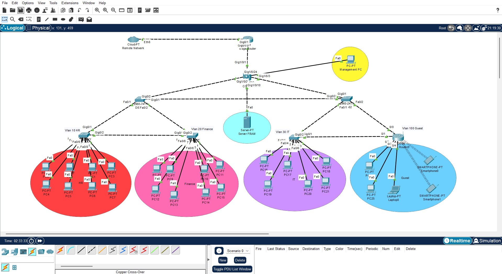

# Enterprise Network Lab (Cisco Packet Tracer)

## 📌 Overview
This project simulates a small enterprise network using **Cisco Packet Tracer**, applying industry best practices:
- Core–Distribution–Access design
- Multiple VLANs for HR, Finance, IT, Guest, and Servers
- Inter-VLAN routing via a Layer 3 Core switch (3560)
- DHCP, DNS, AD server integration
- Edge router performing NAT + ACL for Guest isolation
- Security features: BPDU Guard, Port Security

---

## 🖥️ Topology


---

## 🌐 VLAN & IP Schema
| VLAN | Department | Subnet | Gateway (SVI) |
|------|------------|---------|---------------|
| 10   | HR         | 10.10.10.0/24 | 10.10.10.1 |
| 20   | Finance    | 10.10.20.0/24 | 10.10.20.1 |
| 30   | IT         | 10.10.30.0/24 | 10.10.30.1 |
| 99   | Management | 10.10.99.0/24 | 10.10.99.1 |
| 100  | Guest      | 10.10.100.0/24 | 10.10.100.1 |
| 200  | Servers    | 10.10.200.0/24 | 10.10.200.1 |

---

## ⚙️ Core Switch Config (Sample)
```cisco
ip routing
!
vlan 10
vlan 20
vlan 30
vlan 99
vlan 100
vlan 200
!
interface vlan10
 ip address 10.10.10.1 255.255.255.0
 no shut
...
